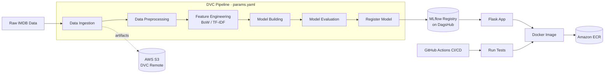

<h1 align="center">🎬 IMDB Sentiment Analysis — End-to-End MLOps Pipeline</h1>

<p align="center">
  <em>A production-grade NLP system that classifies movie reviews as <b>positive</b> or <b>negative</b> — built with a fully automated, reproducible and cloud-deployed MLOps workflow.</em>
</p>

<p align="center">
  
  
  
  
  
  
  
</p>

---

## 📌 Overview

Most ML projects stop at a notebook. **This one doesn't.**

This project takes a classic NLP problem — binary sentiment classification on the IMDB movie review dataset — and wraps it in the engineering discipline a real production system demands: versioned data, tracked experiments, a reproducible pipeline, a model registry with staged promotion, automated tests, containerisation, and a CI/CD pipeline that ships the image to AWS ECR on every push.

The result is a system where **any commit can be traced back to the exact data, parameters, code and metrics that produced it** — and redeployed with a single pipeline run.

| | |
|---|---|
| **Problem type** | Binary text classification (sentiment analysis) |
| **Dataset** | IMDB Movie Reviews |
| **Serving** | Flask REST API + web UI |
| **Focus** | MLOps engineering, reproducibility, automation |

---

## ✨ Key Highlights

- 🔁 **Fully reproducible pipeline** — the entire flow from raw data to a registered model runs with a single `dvc repro`
- 📊 **Remote experiment tracking** — every run, parameter and metric logged to MLflow on DagsHub
- 🗂️ **Data & model versioning** — DVC with AWS S3 as remote storage, so large artifacts never bloat Git
- 🏷️ **Model registry with promotion** — models are registered, evaluated and promoted through stages rather than overwritten
- 🧪 **Automated testing** — model-loading, model-performance and API tests gate every build
- 🐳 **Containerised serving** — a lean Docker image with secrets injected at runtime, never baked in
- ⚙️ **CI/CD on GitHub Actions** — test → build → authenticate → push to Amazon ECR, automatically
- 📐 **Cookiecutter Data Science structure** — a conventional, readable layout any engineer can navigate

---

## 🏗️ System Architecture



**The flow in words:** raw data is ingested and versioned, preprocessed and vectorised, then a model is trained and evaluated. If it clears the metric thresholds, it's registered to the MLflow Model Registry. The Flask app pulls the promoted model from the registry at serve time, gets packaged into a Docker image by CI, and the image is pushed to Amazon ECR ready for deployment.

---

## 🛠️ Tech Stack

| Layer | Tools |
|---|---|
| **Language & ML** | Python 3.10, scikit-learn, NLTK, pandas, NumPy |
| **Experiment Tracking** | MLflow, DagsHub |
| **Pipeline & Versioning** | DVC, Git |
| **Artifact Storage** | AWS S3 |
| **Serving** | Flask |
| **Containerisation** | Docker, Docker Hub |
| **CI/CD** | GitHub Actions |
| **Cloud Registry** | Amazon ECR (IAM-scoped access) |
| **Testing** | pytest, unittest |
| **Project Scaffolding** | Cookiecutter Data Science |

---


## 🔬 ML Pipeline Stages

The pipeline is declared in `dvc.yaml`, so every stage knows its dependencies, parameters and outputs. Change one parameter and DVC re-runs only what's affected.

| # | Stage | What it does |
|---|---|---|
| 1 | **Data Ingestion** | Loads the IMDB dataset, splits into train/test, writes versioned raw data |
| 2 | **Data Preprocessing** | Lowercasing, punctuation and stopword removal, lemmatisation |
| 3 | **Feature Engineering** | Converts text to numerical vectors (Bag-of-Words / TF-IDF) |
| 4 | **Model Building** | Trains the classifier on the engineered features |
| 5 | **Model Evaluation** | Computes accuracy, precision, recall, AUC → logs to MLflow |
| 6 | **Register Model** | Registers the run's model in the MLflow Model Registry |

All hyperparameters — test split ratio, `max_features`, model settings — live in **`params.yaml`**, keeping configuration cleanly separated from code.

---

## 📈 Experiment Tracking

Experiments are tracked remotely on **DagsHub-hosted MLflow**, meaning every run is comparable, shareable and permanently linked to its commit.

**Logged for every run:**
- Hyperparameters from `params.yaml`
- Evaluation metrics (accuracy, precision, recall, ROC-AUC)
- Model artifacts and the vectorizer
- Run metadata for one-click comparison in the MLflow UI

> 🔗 **MLflow UI:** `https://dagshub.com/<your-username>/<your-repo>.mlflow`

### Results

| Model | Accuracy | Precision | Recall | ROC-AUC |
|---|---|---|---|---|
| Logistic Regression (TF-IDF) | `--` | `--` | `--` | `--` |
| _Add your best run here_ | | | | |

---

## 🚀 Getting Started

### Prerequisites

- Python 3.10 (Conda recommended)
- Git, Docker Desktop
- An AWS account (S3 bucket + IAM user) and a DagsHub account

### 1. Clone and set up the environment

```bash
git https://github.com/estkayon/MLOps-Capstone-Project.git

conda create -n atlas python=3.10 -y
conda activate atlas

pip install -r requirements.txt
```

### 2. Configure credentials

Create a `.env` file (never commit it) or export the variables in your shell:

```bash
export CAPSTONE_TEST=<your_dagshub_token>
export AWS_ACCESS_KEY_ID=<your_key>
export AWS_SECRET_ACCESS_KEY=<your_secret>
export AWS_REGION=<your_region>
```

Then configure the AWS CLI for DVC:

```bash
aws configure
```

### 3. Pull versioned data

```bash
dvc pull
```

### 4. Run the full pipeline

```bash
dvc repro      # executes every stage that needs re-running
dvc status     # confirm everything is up to date
dvc push       # push artifacts to the S3 remote
```

### 5. Serve the model

```bash
cd flask_app
python app.py
```

Open **`http://localhost:5000`**, paste in a review, and get a sentiment prediction.

---

## 🐳 Docker

```bash
# Build the image from the project root
docker build -t capstone-app:latest .

# Run it, injecting the auth token at runtime
docker run -p 8888:5000 -e CAPSTONE_TEST=<your_dagshub_token> capstone-app:latest
```

The app is then available at **`http://localhost:8888`**.

> **Design note:** credentials are *never* baked into the image. The MLflow tracking setup reads them from environment variables at container start, so the same image is safe to push to a registry and promote across environments.

---

## ⚙️ CI/CD Pipeline

Defined in `.github/workflows/ci.yaml` and triggered on every push:

```
push → install deps → run pytest suite → build Docker image
     → authenticate with AWS ECR → tag & push image
```

**Required GitHub Secrets:**

| Secret | Purpose |
|---|---|
| `CAPSTONE_TEST` | DagsHub token for MLflow authentication |
| `AWS_ACCESS_KEY_ID` | AWS programmatic access |
| `AWS_SECRET_ACCESS_KEY` | AWS programmatic access |
| `AWS_REGION` | Target AWS region |
| `AWS_ACCOUNT_ID` | Used to construct the ECR registry URI |
| `ECR_REPOSITORY` | Destination ECR repository name |

The IAM user requires `AmazonS3FullAccess` and `AmazonEC2ContainerRegistryFullAccess` (scope these down for production use).

---

## 🧪 Testing

```bash
pytest tests/
```

The suite covers:
- **Model loading** — the registered model can be pulled from the MLflow registry
- **Model performance** — metrics meet a minimum threshold before promotion
- **Flask API** — endpoints return the expected status codes and response shape

These run automatically in CI, so a regression never reaches the container registry.

---

## 🗺️ Roadmap

- [ ] Deploy to AWS ECS / EKS with auto-scaling
- [ ] Add data drift and model monitoring (Evidently AI)
- [ ] Swap the classical model for a fine-tuned transformer (DistilBERT)
- [ ] Add Prometheus + Grafana observability
- [ ] Automated retraining triggered by drift detection

---

## 👤 Author

**Md Estiak Rahman Ayon**
Full-Stack Developer · MLOps Enthusiast

<p>
  <a href="https://github.com/estkayon"></a>
  <a href="https://linkedin.com/in/<your-linkedin>"></a>
</p>

---

## 📄 License

Released under the MIT License. See [`LICENSE`](LICENSE) for details.

---

<p align="center">
  <sub>If this project gave you an idea or two, a ⭐ on the repo is always appreciated.</sub>
</p>
